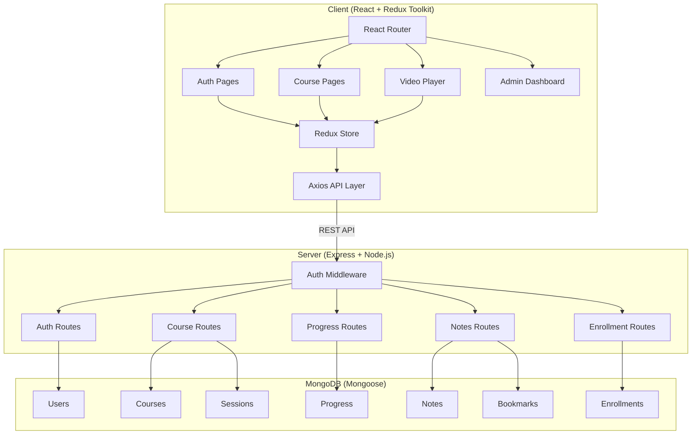

# LMS Portal — Full-Stack MERN Implementation Plan

## Architecture Overview



## Project Structure

```
Summer intern/
├── server/
│   ├── config/         # DB connection, env config
│   ├── middleware/      # Auth, error handling
│   ├── models/         # Mongoose schemas
│   ├── routes/         # Express route handlers
│   ├── controllers/    # Business logic
│   ├── utils/          # Helpers (token generation)
│   ├── server.js       # Entry point
│   ├── package.json
│   └── .env.example
├── client/
│   ├── src/
│   │   ├── components/   # Reusable UI components
│   │   ├── pages/        # Route pages
│   │   ├── store/        # Redux slices
│   │   ├── services/     # Axios API calls
│   │   ├── hooks/        # Custom React hooks
│   │   ├── App.jsx
│   │   └── main.jsx
│   ├── public/
│   ├── index.html
│   ├── package.json
│   └── tailwind.config.js
├── README.md
└── .env.example
```

## Task Breakdown

### T1: User Auth & Role System
- JWT access + refresh tokens
- bcrypt password hashing
- Three roles: Student, Instructor, Admin
- Protected route middleware
- Login, Register, Logout endpoints

### T2: Course & Session CRUD API
- Full CRUD for courses (Instructor/Admin)
- Session management with video URLs
- Course metadata: title, description, domain, thumbnail, instructor

### T3: Student Progress Tracker
- Per-session watch percentage
- Mark-as-complete functionality
- Aggregate course completion percentage

### T4: Search, Filter & Enrollment
- Text search on course title/description
- Domain filter (Web, AI/ML, DevOps, etc.)
- Paginated listing
- Enrollment status per card

### T5: Notes & Bookmarks
- Timestamped notes linked to video sessions
- Bookmark sessions for later revisit

## DB Schema

| Collection   | Key Fields |
|-------------|-----------|
| Users       | name, email, password, role, avatar, refreshToken |
| Courses     | title, description, domain, thumbnail, instructor, sessions[] |
| Sessions    | title, description, videoUrl, duration, courseId, order |
| Enrollments | studentId, courseId, enrolledAt |
| Progress    | studentId, sessionId, courseId, watchPercentage, completed |
| Notes       | studentId, sessionId, timestamp, text |
| Bookmarks   | studentId, sessionId |
